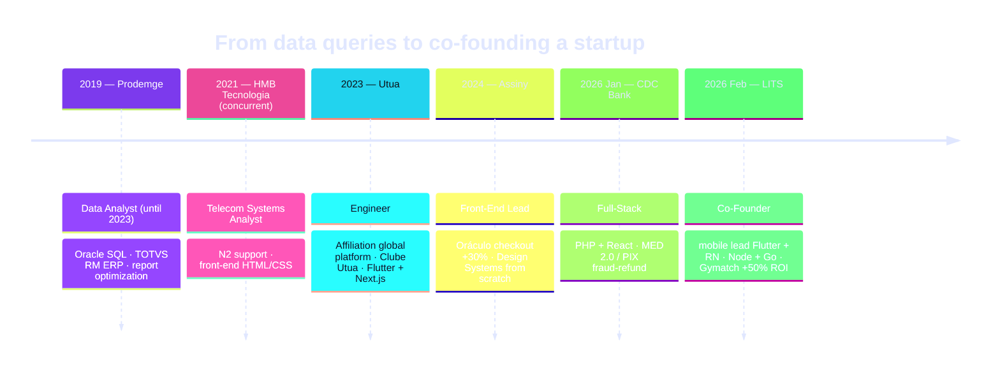

<!-- ════════════════════════════════════════════════════════════════════════
       SVG CINEMA  ·  João Ricardo Rezende Vaz de Mello
       Software Engineer · Mobile & Full Stack · Co-Founder · Belo Horizonte, BR
       Every file in /assets is hand-crafted animated SVG (SMIL + embedded CSS).
       No fake metrics. Every number is CV-verified.
     ════════════════════════════════════════════════════════════════════════ -->

<!-- ░░░░░░░░░░░░░░░░░░░░░░░░░░░░░░  HERO  ░░░░░░░░░░░░░░░░░░░░░░░░░░░░░░ -->
<div align="center">
  <a href="https://github.com/joaoricardovm">
    
  </a>
</div>

<div align="center">

[](https://www.linkedin.com/in/joaoricardovm)
[](https://www.instagram.com/joaoricardovm)
[](mailto:joaoricardovazdemello@gmail.com)
[](https://github.com/joaoricardovm)

</div>

<div align="center">
  
</div>

<!-- ░░░░░░░░░░░░░░░░░░░░░░░░░░  01 · THE IMPACT  ░░░░░░░░░░░░░░░░░░░░░░░ -->
## `01` · the impact

<div align="center">
  
</div>

Three numbers. Three production systems. Zero rounding-up.

```diff
+ +30% sales volume   ·  "Oráculo" event-handling strategy on Assiny's checkout
- −91% infra cost     ·  Gymatch infrastructure cut from US$430/mo -> US$40/mo
+ +50% ROI            ·  leading the React Native -> Flutter migration end-to-end
```

> <samp>My work isn't measured in commits — it's measured in **sales lifted, infra bills slashed, and ROI returned.**</samp>

<div align="center">
  
</div>

<!-- ░░░░░░░░░░░░░░░░░░░░░░░░░░  02 · THE OPERATOR  ░░░░░░░░░░░░░░░░░░░░░ -->
## `02` · the operator

<table>
<tr>
<td width="58%" valign="top">

```ts
const joao = {
  role:      "Software Engineer · Mobile & Full Stack",
  based:     "Belo Horizonte, Brazil 🇧🇷",
  building:  ["LITS (co-founder)", "CDC Bank (fintech)"],
  craft:     "modular, scalable architecture + design systems from scratch",
  obsession: "performance",
  speaks:    ["pt", "en", "es", "zh", "fr"], // 5 languages — native to A1, see table
  poweredBy: "Claude Code",
} as const;
```

I build **mobile and full-stack products end-to-end** — from the
architecture and the design system up to the last frame of jank
I refuse to ship. Right now I'm co-founding a sports social network
+ court-booking marketplace **while** delivering fintech systems in
parallel. ~7 years turning hard problems into shipped product.

</td>
<td width="42%" valign="top">

**`kernel modules` — stack**<br/>


**`infra & craft` — tooling**<br/>


</td>
</tr>
</table>

### Two processes, running simultaneously

I'm currently holding two roles at once — concurrent, no blocking:

```text
USER   PID   %CPU  STAT  STARTED    COMMAND
joao   2602  60.0  Run   Feb 2026   /usr/bin/lits --role=co-founder --stack="flutter,rn,node,go"
                                     └─ sports social network + B2B2C court-booking marketplace
                                     └─ private beta: São Paulo -> Belo Horizonte -> Rio
                                     └─ subprocess: gymatch [RN->Flutter | +50% ROI | infra −91%]
joao   2601  40.0  Run   Jan 2026   /usr/bin/cdc-bank --stack="php,react" --domain=fintech
                                     └─ shipped MED 2.0 integration end-to-end (PIX fraud-refund)
joao      1  ──    Idle  always-on  /usr/bin/curiosity --langs=5 --copilot=claude-code [never exits]
```

<div align="center">
  
</div>

<!-- ░░░░░░░░░░░░░░░░░░░░░░░░░░  03 · WHAT I SHIPPED  ░░░░░░░░░░░░░░░░░░░ -->
## `03` · what I shipped

<table>
<tr>
<td width="50%" valign="top">

#### 🔮 Oráculo — event-handling strategy
<sub>High-performance checkout at **Assiny** (TS / React / Next.js). Designed the *Oráculo* event-handling strategy and owned the checkout end-to-end for 6+ months, plus full SEO + performance work.</sub>

```diff
+ Impact: +30% sales volume
```

</td>
<td width="50%" valign="top">

#### 🚀 Gymatch — RN → Flutter migration
<sub>Led the **React Native → Flutter** migration and re-architected the app (LITS Holding). Rebuilt the infrastructure from the ground up.</sub>

```diff
+ Impact: +50% ROI
- Infra:  US$430/mo -> US$40/mo (−91%)
```

</td>
</tr>
<tr>
<td width="50%" valign="top">

#### 🏦 MED 2.0 — fintech integration
<sub>At **CDC Bank**, delivered the **MED 2.0** integration system end-to-end (PHP backend + React front-end) in the PIX fraud-refund mechanism domain.</sub>

```diff
+ Impact: shipped end-to-end, in production
```

</td>
<td width="50%" valign="top">

#### 🎨 Design Systems + NoWalls
<sub>Built **two design systems from scratch** (Storybook) — including a Web Components / **Lit** version letting sellers theme their own checkout. On *NoWalls*, led front-end app + admin with **Jest + E2E** automated testing.</sub>

```diff
+ Impact: reusable DS + theming + test coverage
```

</td>
</tr>
</table>

<div align="center">
  
</div>

<!-- ░░░░░░░░░░░░░░░░░░░░░░░░░░  04 · THE STACK IN ORBIT  ░░░░░░░░░░░░░░░ -->
## `04` · the stack, in orbit

<div align="center">
  
</div>

<div align="center">
  
</div>

<!-- ░░░░░░░░░░░░░░░░░░░░░░░░░░  05 · THE TRAJECTORY  ░░░░░░░░░░░░░░░░░░░ -->
## `05` · the trajectory

> <samp>Data Analyst → Engineer → Co-Founder. Seven years compounding.</samp>



<details>
<summary><b>📜 the long-form journey</b> — roles, dates and what I owned</summary>

<br/>

<table>
<tr>
<td valign="top" width="50%">

🟣 **LITS** · *Co-Founder* · `Feb 2026 — now`<br/>
<sub>Sports social network + B2B2C court-booking marketplace. Private beta in São Paulo, expanding to BH &amp; Rio. I lead mobile (**Flutter + React Native**) backed by **Node.js + Golang** services.<br/>↳ *Gymatch* — led the **RN → Flutter** migration &amp; re-architecture → **+50% ROI**, infra **US$430 → US$40/mo (−91%)**.</sub>

<br/><br/>

🟢 **CDC Bank** · *Full-Stack Engineer* · `Jan 2026 — now`<br/>
<sub>Fintech. **PHP** backend + **React** front-end. Delivered the **MED 2.0** integration system end-to-end (PIX fraud-refund mechanism domain).</sub>

<br/><br/>

🔵 **Assiny** · *Front-End Lead* · `Jan 2024 — Jan 2026`<br/>
<sub>Owned a high-performance checkout (**TS/React/Next.js**) end-to-end 6+ months. Designed the *Oráculo* event-handling strategy → **+30% sales volume**. Built a **Design System from scratch** (Storybook) + a Web Components / **Lit** version so sellers could theme their own checkout. Led full **SEO + performance** work.<br/>↳ *NoWalls* — led front-end app + admin, DS from scratch, **Jest + E2E**, Storybook library, scalable backend planned on **Encore TS**.</sub>

</td>
<td valign="top" width="50%">

🟠 **Utua** · *Engineer* · `Feb 2023 — Jan 2024`<br/>
<sub>Built the Utua Affiliation global web platform; led the **Clube Utua** site (clube.utua.com.br). **Flutter + Next.js**.</sub>

<br/><br/>

⚪ **HMB Tecnologia** · *Telecom Systems Analyst* · `Apr 2021 — Jan 2023`<br/>
<sub>N2 support + front-end (**HTML/CSS**) for telecom systems.</sub>

<br/><br/>

🟡 **Prodemge** · *Data Analyst* · `Aug 2019 — Feb 2023` *(concurrent with HMB)*<br/>
<sub>**Oracle SQL**, TOTVS RM ERP, query &amp; report optimization.</sub>

<br/><br/>

🎓 **PUC Minas** — B.Eng. Computer Engineering + Análise e Desenvolvimento de Sistemas.<br/>
<sub>Swift course — Instituto de Pesquisas ELDORADO (2020).</sub>

</td>
</tr>
</table>

</details>

<div align="center">
  
</div>

<!-- ░░░░░░░░░░░░░░░░░░░░░░░░░░  06 · GITHUB IN MOTION  ░░░░░░░░░░░░░░░░░ -->
## `06` · github in motion

<div align="center">


</div>

<!-- Pac-Man eating my real contribution graph (generated by a committed GitHub Action) -->
<div align="center">
  <picture>
    <source media="(prefers-color-scheme: dark)" srcset="https://raw.githubusercontent.com/joaoricardovm/joaoricardovm/output/pacman-contribution-graph-dark.svg" />
    <source media="(prefers-color-scheme: light)" srcset="https://raw.githubusercontent.com/joaoricardovm/joaoricardovm/output/pacman-contribution-graph.svg" />
    
  </picture>
</div>

<div align="center">
  
</div>

<!-- ░░░░░░░░░░░░░░░░░░░░░░░░░░  07 · OFF THE RESUME  ░░░░░░░░░░░░░░░░░░░ -->
## `07` · off the resume

I greet the world in five languages — every level is real:

| | Language | Level |
|:--:|:--|:--:|
| 🇧🇷 | **Olá** — Português | `native` |
| 🇬🇧 | **Hello** — English | `B2` |
| 🇪🇸 | **Hola** — Español | `B1` |
| 🇨🇳 | **你好** — 中文 | `A2` |
| 🇫🇷 | **Bonjour** — Français | `A1` |

<details>
<summary><b>❤️ the part that isn't in the metrics</b></summary>

<br/>

From **2023 to 2025** I volunteered weekly with **Instituto Be Grateful**, doing
street outreach in Belo Horizonte — hot meals, dog food and clothing for homeless
people **and their pets**. The same care I put into not shipping a single frame of
jank, I try to put into the people I share a city with. It's the most important
thing on this page that has no ROI attached.

</details>

<details>
<summary><b>🤝 you actually scrolled this far — here's my 30-second pitch</b></summary>

<br/>

You dig into the details. That tells me we'd probably work well together.

Here's the short version: I'm a **mobile + full-stack engineer** who ships
**business outcomes**, not just features — I've lifted sales **+30%**, cut infra
bills **−91%**, returned **+50% ROI**, led an **RN → Flutter** migration, and
built **two design systems from scratch**. I'm co-founding **LITS** while shipping
fintech at **CDC Bank**, in parallel. I obsess over performance and architecture
because they're decisions you make once and pay for every day.

If you're building something hard and you want it built **fast, modular and
scalable** — let's talk.

[](https://www.linkedin.com/in/joaoricardovm)
[](mailto:joaoricardovazdemello@gmail.com)

</details>

<div align="center">
  
</div>

<!-- ░░░░░░░░░░░░░░░░░░░░░░░░░░░░  FOOTER  ░░░░░░░░░░░░░░░░░░░░░░░░░░░░░ -->
<div align="center">

> <samp>*Architecture is a decision you make once and pay for every day. I make it deliberately.*</samp>

<br/>

**I move business numbers. Let's talk about yours.**

<br/>

[](https://www.linkedin.com/in/joaoricardovm)
[](https://www.instagram.com/joaoricardovm)
[](mailto:joaoricardovazdemello@gmail.com)

</div>
